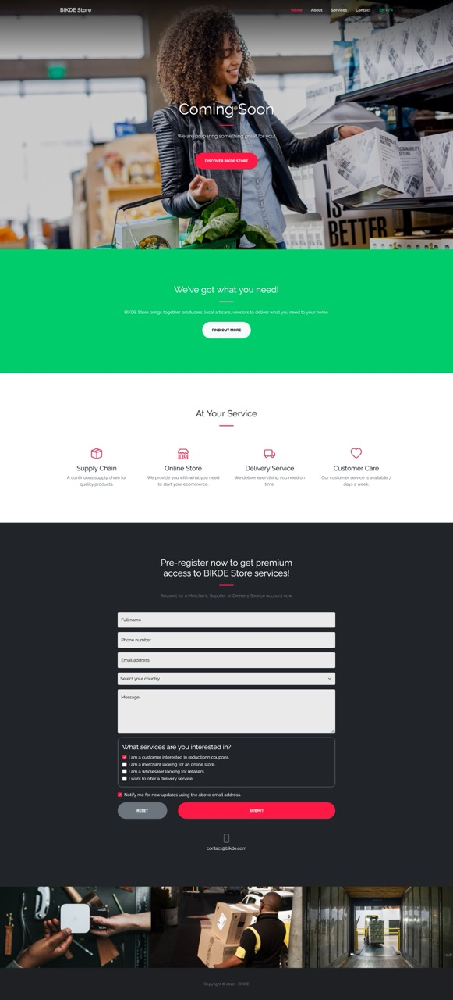
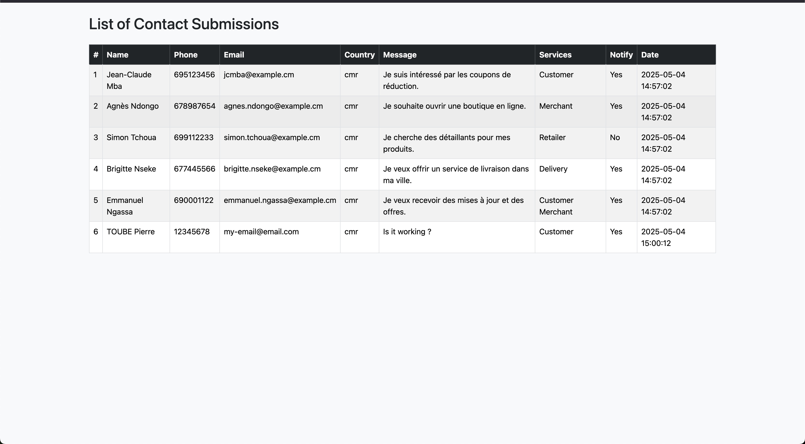

# 📦 Déploiement d'un Site Web — Atelier Pratique

Ce projet s’inscrit dans le cadre d’un **atelier pratique de déploiement web** organisé par le **Centre CIA Formation**, centre de formation professionnelle spécialisé dans les métiers du numérique.  

L’objectif de cet atelier est de vous apprendre à mettre en ligne un site web simple intégrant des pages statiques et dynamiques, ainsi qu'une base de données MySQL.

## 📁 Structure du Projet

Voici la structure du projet que nous allons déployer :

```
.
├── Readme.md
├── admin
│   └── index.php
├── assets/**
├── database.sql
├── index.html
└── readme-assets
├── contact-form-page.png
└── contact-list-page.png

```

## 📖 Description des Fichiers

- `index.html` : Page d’accueil statique du site.
- `admin/index.php` : Interface d’administration pour gérer les contacts.
- `assets/` : Dossier contenant les fichiers CSS, JS et images utilisés par le site.
- `database.sql` : Script SQL pour créer la base de données des contacts.
- `readme-assets/` : Contient les captures d’écran du projet pour illustrer les différentes pages.
- `Readme.md` : Ce fichier de documentation.

## 📸 Aperçu du Projet

### 📄 Page de Formulaire de Contact



---

### 📋 Liste des Contacts



---

## 🛠️ Prérequis

Avant de commencer, assurez-vous d’avoir installé :

- Un serveur web local (comme **XAMPP**, **WAMP** ou **Laragon**)
- **PHP** version 7.4 ou supérieure
- **MySQL/MariaDB**

## ⚙️ Installation

1. Clonez ou téléchargez le projet dans le dossier `www` ou `htdocs` de votre serveur local.
2. Importez le fichier `database.sql` dans **phpMyAdmin** pour créer la base de données.
3. Ouvrez le fichier `admin/index.php` et vérifiez les paramètres de connexion à la base de données si nécessaire.
4. Démarrez votre serveur Apache et MySQL.
5. Accédez au site via `http://localhost/nom_du_projet/`

## 🚀 Déploiement en Ligne

Pour mettre ce projet en ligne :

1. Achetez un nom de domaine et un hébergement web compatible **PHP/MySQL**.
2. Transférez les fichiers du projet via **FTP** (ex : **FileZilla**) dans le dossier `public_html` ou `www` de votre hébergeur.
3. Importez la base de données via le **phpMyAdmin** de votre hébergeur.
4. Mettez à jour les paramètres de connexion à la base de données dans `admin/index.php`.
5. Testez le site en ligne via votre nom de domaine.

---

## ✍️ Atelier réalisé par

**Centre CIA Formation**  
📞 +237 692 17 50 99 / 680 55 07 75  
🌐 [www.ciaformation.com](http://www.ciaformation.com)  
📍 Yaoundé, Cameroun  

---

## 📜 Licence

Projet utilisé exclusivement à des fins pédagogiques dans le cadre des ateliers du **Centre CIA Formation**.
